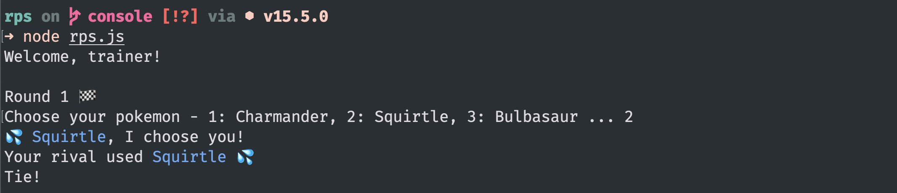

# rps

A Pokémon twist on your classic _Rock, Paper, Scissors_ featuring Kanto starters. Part of the [Odin Project](https://www.theodinproject.com/courses/foundations/lessons/rock-paper-scissors) foundations curriculum.

## Command Line

The current implementation is a CLI that plays for 5 rounds.

### Learning

- Finally, I've decided to learn some JS.
- I played around with console colours to make the CLI "pretty".
- Initially, I tried to use my browser's console, but then decided to install Node.
